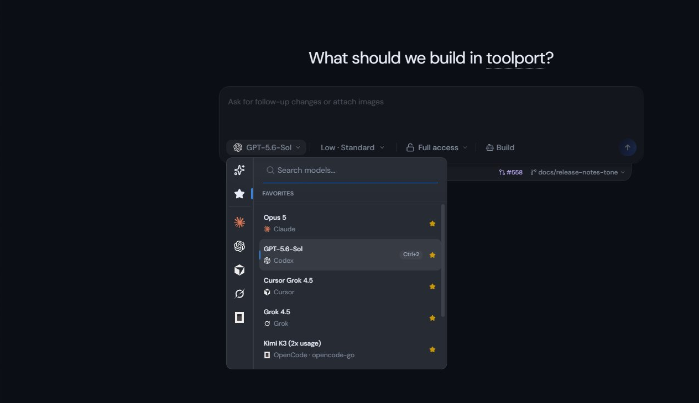

<p align="center">
  
</p>

<h1 align="center">Toolport Studio</h1>

<p align="center">
  <strong>One desktop home for Claude, Codex, Cursor, Grok, and the tools around them.</strong>
</p>

Toolport Studio turns subscription-backed AI coding CLIs into a cohesive desktop
workspace. Start with a normal conversation, paste screenshots, switch providers
and models, then attach a folder when the work becomes a project.



Five providers, one picker. Each row names the CLI behind the model, and the
composer keeps reasoning effort, permission mode, and build mode next to the
model itself rather than buried in settings.

The goal is not to create separate "chat" and "coding" products. A conversation
starts with as little context as you want and grows into a coding workspace when
you add a project, terminal, preview, source control, or Toolport tools.

## Status

Toolport Studio is in beta.

It gets used for real work every day, across multiple providers, by the person
building it. The core loop is well worn at this point: conversations, provider
switching, projects, terminals, diffs, and source control all carry real work
rather than demos.

Beta means the surfaces are not all equally mature, and provider coverage varies
a lot depending on how much each one has actually been driven. The table under
[Providers](#providers) is honest about that. It does not mean the basics are
shaky.

Provider access comes from CLIs you install and sign in to yourself. Toolport
Studio does not resell model access and does not convert API keys into
subscription access.

## Install

Windows, macOS, and Linux builds are published on the
[GitHub Releases page](https://github.com/tsouth89/toolport-studio/releases).

| Platform | Download                        | Signing                                                        |
| -------- | ------------------------------- | -------------------------------------------------------------- |
| Windows  | `.exe` installer                | Azure Trusted Signing. SmartScreen can still warn on first run |
| macOS    | `.dmg`, Apple Silicon and Intel | Developer ID signed and notarized by Apple                     |
| Linux    | `.AppImage`, x86_64             | Unsigned, which is normal for AppImage                         |

Release notes list a SHA-256 for every installer, and checking it is the reliable
way to confirm you have the right file.

Passkey sign-in is not available in the macOS build yet. Every other sign-in
method works. The build ships without the Associated Domains entitlement that
macOS requires for passkeys, which is what keeps it free of a provisioning
profile for now.

## Providers

Install and sign in to the CLI for each provider you want to use, then open
Toolport Studio. It discovers the CLIs already on your machine.

| Provider   | Install from          | Sign in with          |
| ---------- | --------------------- | --------------------- |
| Claude     | claude.com            | `claude auth login`   |
| Codex      | developers.openai.com | `codex login`         |
| Cursor     | cursor.com            | `cursor-agent login`  |
| Grok Build | x.ai                  | `grok login`          |
| OpenCode   | opencode.ai           | `opencode auth login` |

Each provider keeps its own credentials where its CLI already stores them.
Toolport Studio does not copy or re-store them.

### How much each one has been exercised

Adapters are not equally proven, and it would be misleading to present them as a
flat list of supported providers.

| Provider   | Coverage                                                                        |
| ---------- | ------------------------------------------------------------------------------- |
| Claude     | Strongest. Inherits T3 Code's test coverage, plus daily use                     |
| Codex      | Strongest. Same inheritance as Claude                                           |
| Grok Build | Most hands-on use by a wide margin. Started roughest, so it got the most fixing |
| Cursor     | Lighter. Works, less driven in anger                                            |
| OpenCode   | Thinnest. Expect the roughest edges here                                        |

Every adapter runs the same core-loop contract, so a missing behaviour is a test
failure rather than something discovered in use. Where a provider's test double
cannot express a case, the contract records a named waiver that prints in test
output instead of skipping quietly. See
[`apps/server/src/provider/conformance`](./apps/server/src/provider/conformance).

If you hit something broken on a lightly covered adapter, that is useful and
worth reporting. It is where the gaps are most likely to be.

## What works today

- Claude, Codex, Cursor, Grok, and OpenCode provider adapters
- Subscription-backed authentication through installed provider CLIs
- Screenshot and image pasting, including Grok Build conversations
- Projectless chat (start without a folder, attach a project later)
- A curated Recommended model list with the full catalog one click away
- Projects, terminals, previews, source control, and provider switching
- Right-hand **Activity** panel (current step, tools, MCP from Toolport, changed files)
- Automatic discovery of the local Toolport gateway
- Toolport MCP in provider sessions (Settings, **Toolport tools in sessions**,
  off by default so coding turns stay lean)
- Independent Toolport Studio application identity and data directory
  (`~/.toolport-studio`)

## The product model

Toolport Studio has one conversation surface with progressive context:

1. **Start anywhere.** Open the app and talk without choosing a repository.
2. **Choose a provider.** Switch between supported providers without learning a
   different interface for each CLI.
3. **Add context when needed.** Attach a folder, repository, screenshot, file, or
   Toolport tool to the same conversation.
4. **Move into build mode naturally.** Terminals, diffs, previews, approvals, and
   source control appear when the task needs them.

Read [the product foundation](./docs/product/vision.md) for design principles and
roadmap. Shell / Activity work is tracked under
[SOU-386](https://linear.app/southforge-ai/issue/SOU-386) with the contract in
[docs/product/sou-386-shell-design-contract.md](./docs/product/sou-386-shell-design-contract.md).

## Toolport ecosystem

- [Toolport](https://toolport.app) is the MCP control plane. It gives every
  provider the same governed tools and server configuration.
- [Ceiling](https://ceiling.win) provides provider usage, quota,
  reset-window, spend, and activity intelligence.
- [Toolport Studio](https://toolport.studio) is where conversations, providers,
  projects, tools, and usage context come together.

## State directories

| Build                       | App data                                       |
| --------------------------- | ---------------------------------------------- |
| Installed build             | `~/.toolport-studio/userdata`                  |
| Local `dev` / `dev:desktop` | `~/.toolport-studio/dev` (isolated from above) |

## Development

```bash
pnpm install
pnpm dev          # contracts + server + web (watch)
pnpm dev:desktop  # Electron shell against local backend
```

Useful commands:

```bash
pnpm test:desktop-smoke
pnpm build:desktop
pnpm dist:desktop:win:x64    # or :dmg:arm64, :dmg:x64, :linux
```

The workspace publishes under `@toolport-studio/*`. One internal package is still
named `t3` (`apps/server`, which also ships a `t3` binary) and is referenced that
way by the root build scripts. That is a leftover from the fork rather than a
product name, and renaming it touches the installed binary, so it is tracked
separately.

Publish a release (maintainers):

1. Bump the workspace version and push a clean commit to `main`.
2. Run the GitHub Actions **Release** workflow with that version and a short
   summary.

The workflow builds Windows, macOS (both architectures), and Linux in parallel,
then publishes once. A platform that fails does not take the others down, but the
release is refused outright if a required platform produced no installer, so a
release cannot quietly ship less than its notes claim.

See [the documentation index](./docs/README.md) for architecture, provider, and
release details. Release process: [docs/operations/release.md](./docs/operations/release.md).

## Heritage and license

Toolport Studio is based on the open-source
[T3 Code](https://github.com/pingdotgg/t3code) project (MIT). T3 Code is
ancestry, not an active upstream. Credit to T3 Tools Inc. is permanent.

See [LICENSE](./LICENSE) and [NOTICE](./NOTICE).
